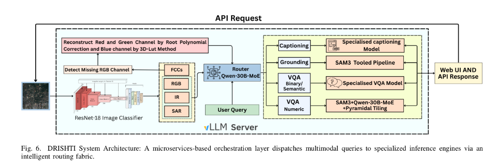
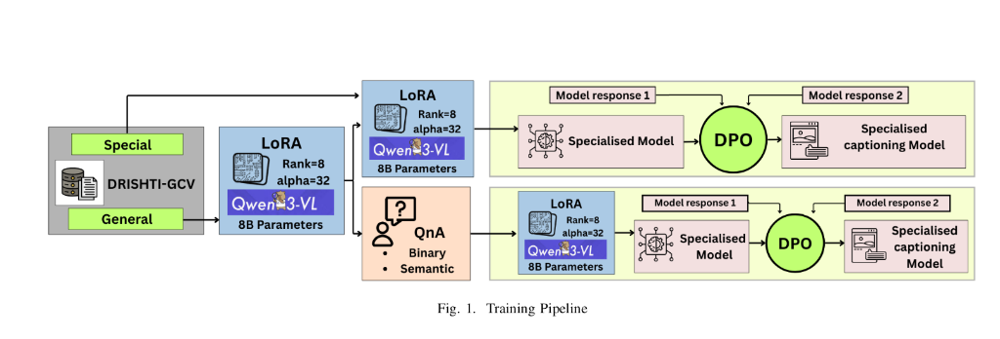

<p align="center">
  
</p>

<h1 align="center">DRISHTI</h1>
<h3 align="center">Deep Remote-sensing Intelligence for Semantic Hybrid Text-Image Understanding</h3>

<p align="center">
  <a href="https://www.akshadrishti.space/"></a>
  <a href="docs/DRISHTI_REPORT_FINAL.pdf"></a>
  <a href="#license"></a>
</p>

---

## Abstract

The proliferation of satellite constellations and high-resolution aerial platforms has generated unprecedented volumes of Remote Sensing (RS) imagery, yet effective natural language interaction with such data remains a significant challenge. **DRISHTI** is a unified Vision-Language Model (VLM) framework enabling intuitive natural language interaction with RS imagery across varied resolutions, sensor modalities, and downstream tasks.

> **Key Results**: +40% BERT-BLEU on captioning, +21% VQA accuracy over GeoChat, and state-of-the-art counting performance on RS benchmarks.

---

## 🎯 Problem Statement

> *"Is the picture really worth a thousand words?"*

The challenge, posed by **ISRO Space Applications Centre** at Inter-IIT TechMeet 14, is to design a functional prototype that empowers non-expert users to interpret and analyze satellite imagery using **natural language**.

The platform must accept processed satellite imagery and perform:
- **Image Captioning** — Generate descriptive captions for RS scenes
- **Visual Question Answering (VQA)** — Answer semantic, binary, and numeric questions
- **Visual Grounding** — Localize objects based on textual queries

See the full problem statement: [ISRO_M3_TechMeet14.pdf](docs/ISRO_M3_TechMeet14.pdf)

---

## 🚀 Key Contributions

| Contribution | Description |
|--------------|-------------|
| **DRISHTI-GCV Dataset** | ~180K difficulty-aware samples spanning Grounding, Captioning, and VQA across RGB, SAR, and IR modalities with resolution metadata (224²–2048²) |
| **Two-Stage Curriculum Learning** | LoRA-based fine-tuning for RS adaptation + DPO alignment for hallucination reduction |
| **Adaptive Hierarchical Grounding (AHG-Net)** | SAM3-based segmentation with pyramidal tiling for accurate counting and area estimation |
| **Multi-Modal Support** | Native handling of RGB, SAR, Infrared, and False Color Composite (FCC) imagery |

---

## 🏗️ System Architecture

<p align="center">
  
</p>

The system employs a **microservices-based orchestration layer** that dispatches multimodal queries to specialized inference engines:

1. **ResNet-18 Classifier** — Detects image modality (RGB, SAR, IR, FCC)
2. **FCC-to-RGB Synthesis** — Reconstructs missing channels via Root Polynomial Correction
3. **Qwen3-VL Router (30B)** — Routes queries to appropriate task pipelines
4. **Specialized Models** — Task-specific VLMs for Captioning, VQA, and Grounding
5. **SAM3 Agent** — Pyramidal tiling for numeric reasoning (counting/area)

---

## 📚 Training Pipeline

<p align="center">
  
</p>

### Stage I: General RS Adaptation
- Base: `Qwen3-VL-8B-Instruct`
- Method: LoRA fine-tuning (rank=16, α=32)
- Data: DRISHTI-GCV generalized split (~52K samples)

### Stage II: Task Specialization
- **Captioning Branch**: Specialized SFT on high-density scenes + DPO alignment
- **VQA Branch**: Sub-classification into Semantic/Binary/Numeric + SAM3 routing
- **Grounding**: AHG-Net with centroid clustering and VLM-based verification

---

## 📊 Results

### Captioning Performance (BERT-BLEU)

| Model | Generalized | Specialized |
|-------|-------------|-------------|
| Qwen3-VL-8B-Instruct | 0.7066 | 0.7199 |
| InternVL3.5-8B | 0.7876 | 0.7347 |
| GPT-4o | — | 0.8174 |
| **DRISHTI** | **0.8216** | **0.8493** |

### VQA Performance

| Model | Binary | Numeric | Semantic |
|-------|--------|---------|----------|
| GeoChat | 0.764 | 0.356 | — |
| Qwen3-VL-8B | 0.948 | 0.665 | 0.833 |
| **DRISHTI** | **0.948** | **0.702** | **0.937** |

### Counting Accuracy by Object Density

| Objects | DRISHTI (SAM3) | VLM Direct |
|---------|----------------|------------|
| 1–10 | 89% | 72% |
| 11–50 | 74% | 41% |
| 51–100 | 61% | 22% |
| 100+ | 48% | 11% |

---

## 🛠️ Installation

### Prerequisites
- Python 3.11+
- Node.js 18+
- MongoDB
- Modal account (for GPU inference)

### Backend Setup

```bash
cd backend
python -m venv .venv && source .venv/bin/activate
pip install -r requirements.txt
cp .env.example .env   # Configure API keys
uvicorn app.main:app --reload --port 8000
```

### Frontend Setup

```bash
cd frontend
npm install
npm run dev   # Starts on http://localhost:3000
```

---

## 📁 Repository Structure

```
├── backend/                    # FastAPI + LangGraph Orchestrator
│   ├── app/
│   │   ├── api/routes/         # REST endpoints
│   │   ├── services/           # Business logic (IR2RGB, modality routing)
│   │   └── orchestrator.py     # LangGraph workflow
│   ├── modal_services/         # GPU services for Modal deployment
│   │   ├── sam3_agent.py       # SAM3 counting/area module
│   │   ├── vllm_modal_deploy.py
│   │   └── ...
│   └── scripts/                # Utility scripts (LoRA merge, etc.)
├── frontend/                   # React/Vite UI
│   └── src/
├── docs/                       # Reports and diagrams
│   ├── DRISHTI_REPORT_FINAL.pdf
│   └── ISRO_M3_TechMeet14.pdf
└── internal_data/              # SAM3 agent source & sample images
```

---

## 📖 References

1. Kuckreja et al., "GeoChat: Grounded Large Vision-Language Model for Remote Sensing," CVPR 2024
2. Muhtar et al., "LHRS-Bot: Empowering Remote Sensing with VGI-Enhanced Large Multimodal Language Model," arXiv 2024
3. Li et al., "VRSBench: A Versatile Vision-Language Benchmark Dataset for RS Image Understanding," AAAI 2024
4. Bai et al., "Qwen3-VL Technical Report," arXiv 2025
5. Ren et al., "Grounded SAM: Assembling Open-World Models for Diverse Visual Tasks," arXiv 2024

---

## 📜 License

This project was developed for **ISRO Inter-IIT TechMeet 14** by Team IIT Kharagpur.

All model weights and code are released under the **Apache 2.0 License** unless otherwise specified.

---

<p align="center">
  <b>Developed with ❤️ for ISRO Space Applications Centre</b>
</p>
