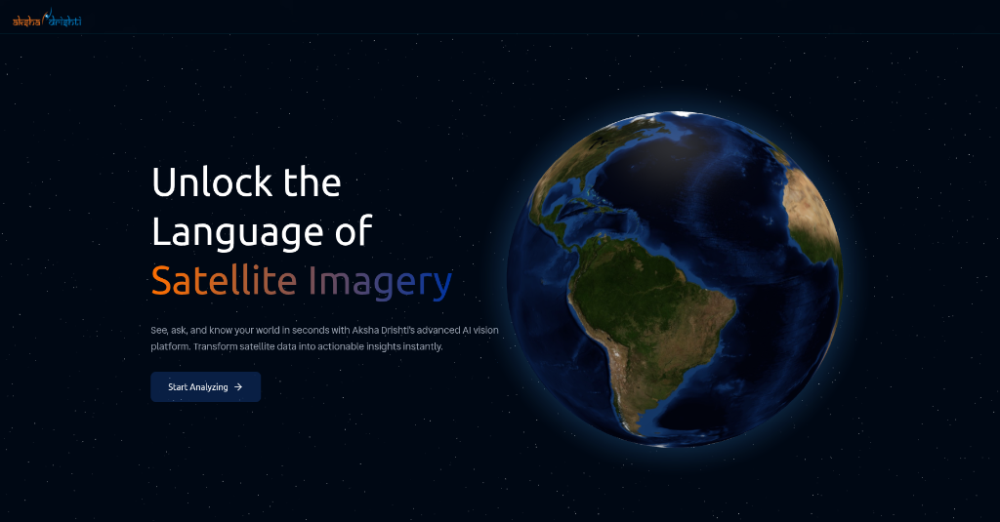

<p align="center">
  
</p>

<h1 align="center">DRISHTI</h1>
<h3 align="center">Deep Remote-sensing Intelligence for Semantic Hybrid Text-Image Understanding</h3>

<p align="center">
  <a href="https://www.akshadrishti.space/"></a>
  <a href="docs/DRISHTI_REPORT_FINAL.pdf"></a>
  <a href="#license"></a>
</p>

<p align="center">
  <b>🏆 4th Place — ISRO Problem Statement, Inter-IIT Tech Meet 14.0</b><br/>
  <b>🥇 Overall Champions — IIT Kharagpur</b>
</p>

---

## Abstract

The proliferation of satellite constellations and high-resolution aerial platforms has generated unprecedented volumes of Remote Sensing (RS) imagery, yet effective natural language interaction with such data remains a significant challenge. **DRISHTI** is a unified Vision-Language Model (VLM) framework enabling intuitive natural language interaction with RS imagery across varied resolutions, sensor modalities, and downstream tasks.

DRISHTI addresses three critical gaps in existing RS-VLM research:
1. **DRISHTI-GCV Dataset** — A large-scale, difficulty-aware dataset (~180K samples) spanning Grounding, Captioning, and VQA
2. **Two-Stage Curriculum Learning** — LoRA-tuned backbone + DPO alignment for hallucination reduction
3. **Numeric Reasoning Pipeline** — SAM3-based module with pyramidal tiling for accurate counting and area estimation

> **Key Results**: +40% BERT-BLEU on captioning, +21% VQA accuracy over GeoChat, and state-of-the-art counting performance.

---

## 🎯 Problem Statement

> *"Is the picture really worth a thousand words?"*

The challenge, posed by **ISRO Space Applications Centre** at Inter-IIT TechMeet 14, is to design a functional prototype that empowers non-expert users to interpret and analyze satellite imagery using **natural language**.

### Required Capabilities

| Task | Description |
|------|-------------|
| **Image Captioning** | Generate descriptive captions for RS scenes |
| **Visual Question Answering** | Answer semantic, binary, and numeric questions |
| **Visual Grounding** | Localize objects based on textual queries |

### Unique Challenges in Remote Sensing

- **Multi-resolution data**: From sub-meter optical to coarse multispectral products
- **Dense object layouts**: Thousands of arbitrarily oriented, small objects
- **Multi-modal imagery**: RGB, SAR, thermal infrared, and multispectral sensors
- **Quantitative reasoning**: Object counting, size estimation, spatial relationships

See the full problem statement: [ISRO_M3_TechMeet14.pdf](docs/ISRO_M3_TechMeet14.pdf)

---

## 🚀 Key Contributions

### 1. DRISHTI-GCV: Difficulty-Aware RS Dataset

| Task | Samples | Resolution Range |
|------|---------|------------------|
| Captioning (Stage I) | ~22k | 256²–512² |
| Captioning (Stage II) | ~20k | up to 2048² |
| Grounding | ~60k | 224²–2048² |
| VQA (Generalized) | ~30k | 256²–512² |
| VQA (Specialized) | ~20k | 512²–2048² |
| SAR (SARLANG) | ~15k | 512² |
| Infrared (GeoAI) | ~13k | 1024² |
| **Total** | **~180k** | **224²–2048²** |

**Source Datasets**: VRSBench, Git-10M, RSVQA-LR/HR, OPT-RSVG, RSVG/RSVG-HR, DIOR/DOTA-v2

### 2. Two-Stage Curriculum Learning

**Stage I: General RS Adaptation**
- Base: `Qwen3-VL-8B-Instruct`
- Method: LoRA fine-tuning (rank=16, α=32, 4-bit QLoRA)
- Data: DRISHTI-GCV generalized split

**Stage II: Task Specialization**
- Captioning: SFT on high-density scenes + DPO alignment (β=0.1)
- VQA: Sub-classification into Semantic/Binary/Numeric
- Grounding: AHG-Net with SAM3 pyramidal tiling

<p align="center">
  
</p>

### 3. Adaptive Hierarchical Grounding Network (AHG-Net)

The grounding pipeline proceeds through six distinct stages:

1. **Subject-Reference Query Decomposition** — Separate primary target from spatial anchor
2. **Pyramidal SAM3 Segmentation** — Multi-scale tiling to capture small objects
3. **Centroid-based Clustering** — Greedy box clustering to reduce redundant candidates
4. **Subject Confidence Estimation** — HIGH/MEDIUM/LOW classification
5. **Chunked VLM Refinement** — Iterative verification of ambiguous proposals
6. **Final Spatial Reasoning** — Directional filtering and superlative selection

---

## 🏗️ System Architecture

<p align="center">
  
</p>

### Routing Logic

| Router | Function |
|--------|----------|
| **ResNet-18 Classifier** | Visual routing — categorizes imagery (RGB/SAR/IR/FCC) |
| **Qwen3-VL-30B** | Query routing — dispatches to Captioning/Grounding/VQA pipelines |

### Inference Engine

| Component | Model | Purpose |
|-----------|-------|---------|
| Primary VLM | Qwen3-VL-8B (LoRA) | Captioning, VQA, semantic reasoning |
| Task Router | Qwen3-VL-30B-A3B | Query classification |
| Segmentation | SAM3 + Pyramidal Tiling | Counting, area estimation |
| Modality Detection | ResNet-18 | RGB/SAR/IR/FCC classification |
| FCC Synthesis | Root Polynomial Correction + 3D-LUT | False Color → RGB reconstruction |

### FCC-to-RGB Reconstruction

For False Color Composite imagery, we:
1. Predict spectral identity of each channel using a dual-path classifier
2. Identify missing RGB band: `B_miss = {R, G, B} \ {ŷ₁, ŷ₂, ŷ₃}`
3. Reconstruct using Root Polynomial Color Correction (RPCC) for R/G, or 3D-LUT for B

---

## 📊 Experimental Results

### Captioning Performance

| Model | Generalized (BERT-BLEU) | Specialized (BERT-BLEU) |
|-------|-------------------------|-------------------------|
| Qwen3-VL-8B-Instruct | 0.7066 | 0.7199 |
| InternVL3.5-8B | 0.7876 | 0.7347 |
| GPT-4o | — | 0.8174 |
| **DRISHTI** | **0.8216** | **0.8493** |

### VQA Performance

| Model | Binary | Numeric | Semantic |
|-------|--------|---------|----------|
| GeoChat | 0.764 | 0.356 | — |
| Qwen3-VL-8B | 0.948 | 0.665 | 0.833 |
| **DRISHTI** | **0.948** | **0.702** | **0.937** |

### Counting Accuracy by Object Density

| Objects | DRISHTI (SAM3 + Pyramidal) | VLM Direct |
|---------|----------------------------|------------|
| 1–10 | 89% | 72% |
| 11–50 | 74% | 41% |
| 51–100 | 61% | 22% |
| 100+ | 48% | 11% |

### Ablation Study

| Configuration | Binary | Numeric | Semantic |
|---------------|--------|---------|----------|
| Base Qwen3-VL-8B | 0.684 | 0.381 | 0.703 |
| + Stage I SFT | 0.721 | 0.392 | 0.756 |
| + Stage II SFT | 0.754 | 0.401 | 0.812 |
| + Question Router | 0.768 | 0.518 | 0.835 |
| + SAM3 Numeric | 0.768 | 0.642 | 0.835 |
| + DPO Alignment | **0.779** | **0.642** | **0.860** |

---

## 🛠️ Installation

### Prerequisites
- Python 3.11+
- Node.js 18+
- MongoDB
- Modal account (for GPU inference)

### Backend Setup

```bash
cd backend
python -m venv .venv && source .venv/bin/activate
pip install -r requirements.txt  # Or: uv pip install -r requirements.txt
cp .env.example .env  # Configure API keys
uvicorn app.main:app --reload --port 8000
```

### Frontend Setup

```bash
cd frontend
npm install
npm run dev  # Starts on http://localhost:3000
```

---

## 📁 Repository Structure

```
├── backend/                    # FastAPI + LangGraph Orchestrator
│   ├── app/
│   │   ├── api/routes/         # REST endpoints (orchestrator_routes.py)
│   │   ├── services/           # Business logic
│   │   │   ├── ir2rgb_service.py       # FCC → RGB reconstruction
│   │   │   ├── modality_router.py      # ResNet modality detection
│   │   │   └── modal_client.py         # Modal GPU service client
│   │   └── orchestrator.py     # LangGraph workflow (Task routing)
│   ├── modal_services/         # GPU services for Modal deployment
│   │   ├── sam3_agent.py       # SAM3 pyramidal counting/area
│   │   ├── vllm_modal_deploy.py # vLLM server
│   │   ├── captioning.py       # Specialized captioning model
│   │   ├── vqa.py              # Specialized VQA model
│   │   └── grounding.py        # AHG-Net grounding
│   └── scripts/                # Utility scripts (LoRA merge)
├── frontend/                   # React/Vite UI
│   └── src/
├── docs/                       # Reports and diagrams
│   ├── DRISHTI_REPORT_FINAL.pdf
│   ├── ISRO_M3_TechMeet14.pdf
│   ├── architecture.png
│   └── training_pipeline.png
└── internal_data/              # SAM3 agent source & sample images
    └── sam3-agent/             # Full SAM3 library
```

---

## 🔧 Training Hyperparameters

| Parameter | Value |
|-----------|-------|
| Base Model | Qwen3-VL-8B-Instruct |
| LoRA Rank (r) | 16 |
| LoRA Alpha (α) | 32 |
| Quantization | 4-bit QLoRA |
| Effective Batch Size | 256 |
| Learning Rate | 5 × 10⁻⁵ |
| Optimizer | AdamW-8bit |
| Epochs (Stage I) | 3 |
| Epochs (Stage II) | 2 |
| DPO β | 0.1 |

---

## 📖 References

1. Kuckreja et al., "GeoChat: Grounded Large Vision-Language Model for Remote Sensing," CVPR 2024
2. Muhtar et al., "LHRS-Bot: Empowering Remote Sensing with VGI-Enhanced Large Multimodal Language Model," arXiv 2024
3. Li et al., "VRSBench: A Versatile Vision-Language Benchmark Dataset for RS Image Understanding," AAAI 2024
4. Bai et al., "Qwen3-VL Technical Report," arXiv 2025
5. Ren et al., "Grounded SAM: Assembling Open-World Models for Diverse Visual Tasks," arXiv 2024
6. Lobry et al., "RSVQA: Visual Question Answering for Remote Sensing Data," arXiv 2020
7. Liu et al., "Grounding DINO: Marrying DINO with Grounded Pre-training for Open-Set Object Detection," CVPR 2023

---

## 🏆 Team & Acknowledgments

This project was developed by **IIT Kharagpur ISRO CV Contingent** for the **ISRO Space Applications Centre** problem statement at **Inter-IIT Tech Meet 14.0**.

### Competition Results

| Achievement | Details |
|-------------|---------|
| **Problem Statement Rank** | 🏅 **4th Place** — ISRO Natural Language Satellite Imagery Analysis |
| **Overall Standing** | 🥇 **Champions** — IIT Kharagpur won Inter-IIT Tech Meet 14.0 |

### Acknowledgments

We thank **ISRO Space Applications Centre** for providing this challenging problem statement that pushes the boundaries of Vision-Language Models in the remote sensing domain. Special thanks to the organizers of Inter-IIT Tech Meet 14.0 for hosting this prestigious competition.

---

## 📜 License

All model weights and code are released under the **Apache 2.0 License** unless otherwise specified.

| Component | License |
|-----------|---------|
| Qwen3-VL | Apache 2.0 |
| SAM3 | Apache 2.0 |
| ResNet (Torchvision) | BSD 3-Clause |
| Custom Code | Apache 2.0 |

---

<p align="center">
  <b>Built with equal parts hard work, questionable sleep schedules, and industrial quantities of energy drinks by the Contingent Team of ISRO CV, IIT Kharagpur — for ISRO GeoNLI Challenge Inter IIT Tech Meet 14.0</b>
</p>
