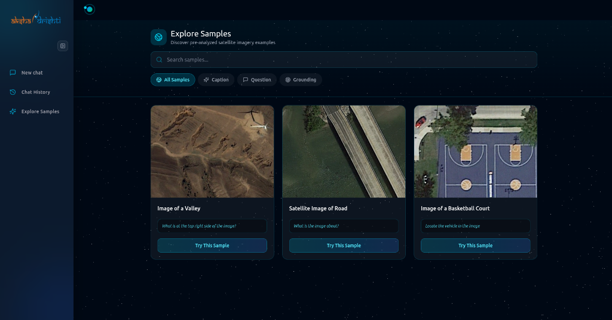

# Frontend — DRISHTI Web Interface

React-based user interface for natural language interaction with satellite imagery.

## Features

- 🖼️ **Image Upload** — Drag-and-drop support for RGB, SAR, IR imagery
- 💬 **Chat Interface** — Conversational multimodal interaction
- 📊 **Result Visualization** — Bounding boxes, masks, and annotated responses
- 🎨 **Dark Theme** — Space-inspired UI with smooth animations
- 📱 **Responsive** — Works on desktop and tablet

## Tech Stack

- **Framework**: React 18 + TypeScript
- **Build Tool**: Vite
- **Styling**: TailwindCSS 4
- **UI Components**: Radix UI primitives
- **State Management**: React Context
- **Routing**: React Router v7

## Getting Started

```bash
# Install dependencies
npm install

# Start development server
npm run dev    # → http://localhost:3000

# Production build
npm run build
```

## Project Structure

```
src/
├── components/
│   ├── ChatInput.tsx       # Message input with image upload
│   ├── ChatMessage.tsx     # Message rendering (text, boxes, masks)
│   ├── Dropzone.tsx        # Image upload zone
│   ├── Sidebar.tsx         # Navigation and chat history
│   └── ui/                 # Radix-based UI primitives
├── pages/
│   ├── Home.tsx            # Main chat interface
│   ├── LandingPage.tsx     # Landing/onboarding
│   └── ExploreSamplesPage.tsx  # Sample image gallery
├── services/
│   └── chatService.ts      # API client for backend
└── types/
    └── chat.ts             # TypeScript interfaces
```

## Environment Variables

Create a `.env.local` file:

```bash
VITE_API_URL=http://localhost:8000
VITE_CLERK_PUBLISHABLE_KEY=...  # Optional: for auth
```

## Screenshots

The interface provides a unified chat panel for multimodal interaction:


